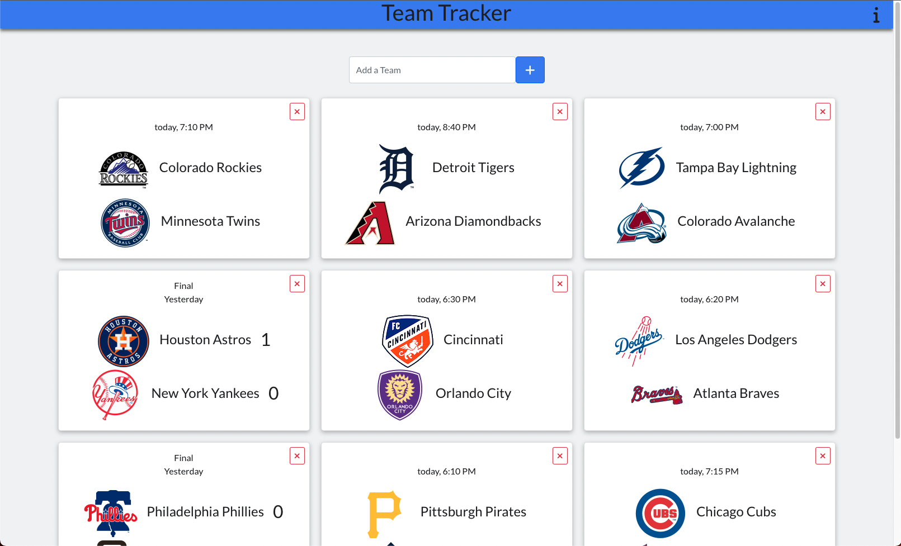
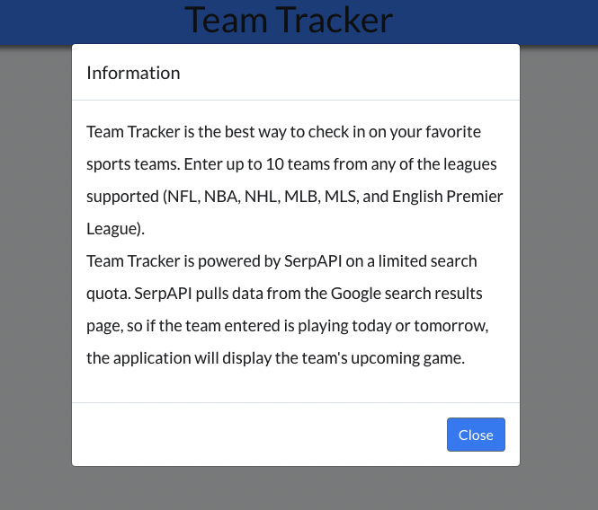
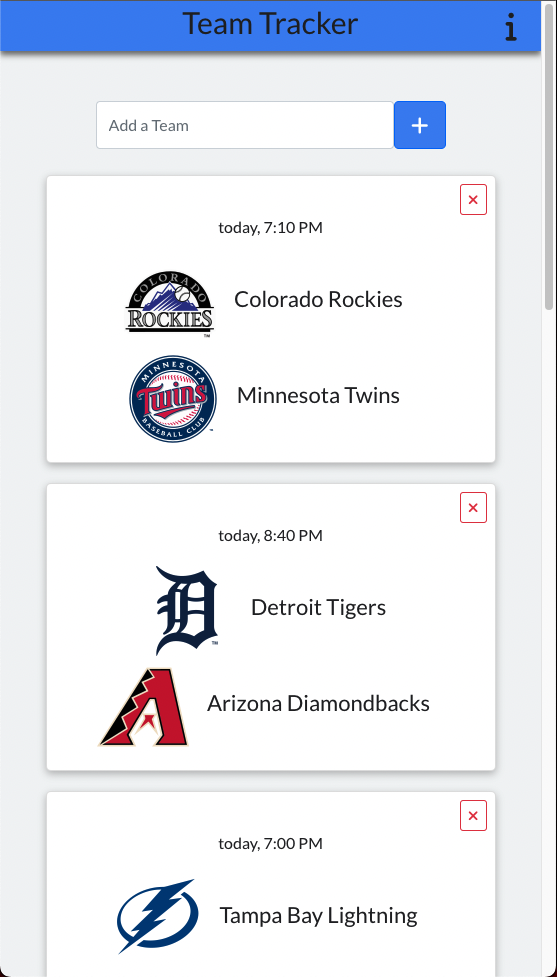
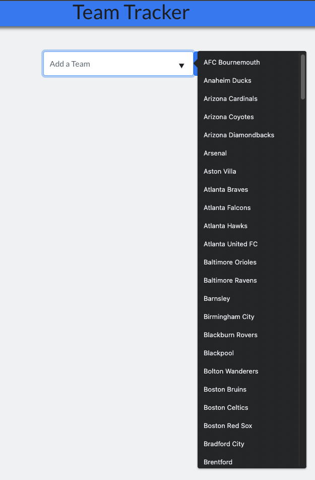

  <h1 align="center">Team Tracker</h1>

  

    A responsive web application that allows users to check in on their favorite sports teams.
     
    <a href="https://teamtracker3000.herokuapp.com" target="_blank"><strong>Live Site »</strong></a> 
    <a href="https://youtu.be/D4Kb5SCiFe4" target="_blank"><strong>Demo Video »</strong></a>
     
     
  

  
Table of Contents

  <ol>
    <li>
      <a href="#about-the-project">About The Project</a>
      <ul>
        <li><a href="#built-with">Built With</a></li>
      </ul>
    </li>
    <li><a href="#inspiration">Inspiration</a></li>
    <li><a href="#screenshots">Screenshots</a></li>
    <li><a href="#contact">Contact</a></li>
  </ol>

## About The Project

Site Features:
* Track game information for up to 10 teams simultaneously
* Automatically update information with a refresh or revisit
* NFL, NBA, NHL, MLB, MLS, and English Premier League supported
* Remove and Add teams freely
* MongoDB connection tracks which teams are searched and when
* SerpApi GET request provides the most up to date game information
* Alerts when duplicate team is entered or 10 team limit is reached
* Fully Responsive design

Team Tracker is a web application inspired by the desire to check in on multiple sports teams with a single click. The user is able to add up to 10 teams across multiple professional sports leagues (NFL, NBA, NHL, MLB, MLS, and English Premier League). Whether the team has recently finished a game, or is soon to play, each team's game information will be dsplayed on a card for the user to view.

Team tracker makes use of LocalStorage to pre load the users teams of choice each time they visit the site. The user has the ability to remove and add teams to their liking so they always stay up to date regarding their favorite teams. 

A GET request to the RESTful API, SerpApi, retrieves the information that is then displayed on a card to represent that team. This request is made each time the user inputs a new team or refreshs the page. Powered by MongoDB, Team Tracker also records every team searched, and when they are searched, so site administrators can monitor trends in user behavior.

### Built With

* MERN stack
* MongoDB
* Express.js
* React.js
* Node.js
* SerpApi
* Bootstrap
* Font Awesome

## Inspiration

Working as a Direct Support Professional helping people with developmental disabilities I encountered many amazing people. In the last 2 years I primarily worked with an individual who is a superfan of multiple sports teams. Each day when I picked him up from his home, we searched the scores of all of his favorite teams on my phone. This person is obsessive over the exact scores and he will often ask me to check the scores multiple times in a day. I found myself repeatedly searching Google for the scores of the same handful of teams and this inspired me to create a project that could simplify this task.

## Screenshots

  
  
  
  
  
  

<!-- CONTACT -->
## Contact

Sean Carlson - carlsonseanr@gmail.com - <a href="https://www.linkedin.com/in/sean-carlson-5954b5161" target="_blank">LinkedIn</a>

(<a href="#top">back to top</a>)

